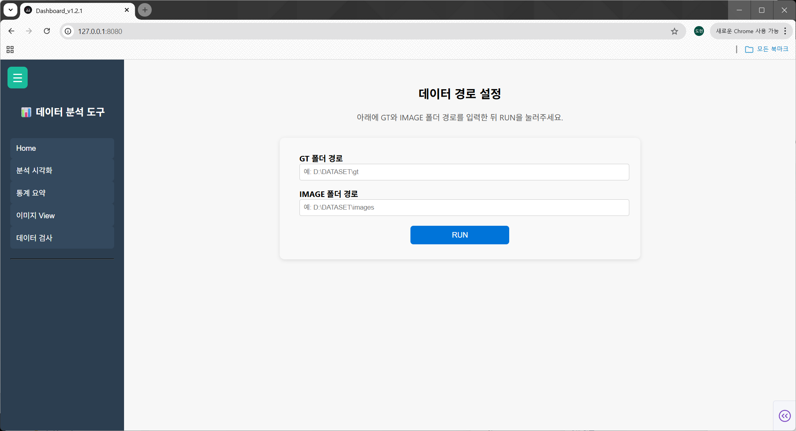

# Bounding Box 분석 및 시각화 대시보드

Python 기반 Dash 웹 애플리케이션으로, Bounding Box(GT) 데이터를 시각적으로 분석하고  
중복 여부, 클래스 분포, 위치 통계, 이미지별 정보를 한눈에 확인할 수 있는 대시보드입니다.

라벨링 결과를 빠르게 검수하거나, 데이터셋의 전체 분포와 품질을 점검하는 용도로 사용할 수 있습니다.

## 📸 Dashboard Overview

- 좌측: 기능 메뉴 (분석 / 통계 / 이미지 / 검수)
- 중앙: 데이터 입력 및 실행
- 각 탭별 시각화 제공

<p align="center">
  
</p>

---
## 실행 방법

1. 저장소 클론
  ```
  git clone <REPOSITORY_URL>
  cd dashboard_v1.2.0
  ```

2. 가상환경 생성 및 활성화
  ```
  conda create -n dashboard_env python=3.9 -y
  conda activate dashboard_env
  ```

3. 패키지 설치:
  ```
  pip install -r requirements.txt
  ```

4. 앱 실행:
  ```
  python app.py
  ```

---

## 데이터셋 경로 설정

- 네트워크 드라이브 환경에서는 UNC 경로(\\192.168...)보다
Windows에 마운트된 로컬 드라이브 경로(Z:\...) 사용을 권장

---

## 웹 브라우저 접속

앱 실행 후, 다음 중 하나의 주소로 접속합니다:

- http://localhost:8080  
- http://<실행PC의 IP>:8080 (예: http://192.168.102.XXX:8080)

---

## 주요 기능

- **Bounding Box 시각화**
  - Width / Height 기준 scatter plot 시각화
  - bbox 중심 좌표 기반 heatmap 생성
  - 특정 영역 bbox 집중도 분석

- **통계 분석**
  - 클래스별 개수 및 비율 확인
  - 데이터 분포 및 주요 통계 확인

- **이미지 확인**
  - 선택한 데이터에 해당하는 이미지 미리보기
  - 산점도, 히트맵, 테이블 클릭 시 연관 이미지 자동 전환

- **데이터 검수**
  - 클래스/좌표 기준 중복 Bounding Box 탐지
  - 이미지 단위 데이터 확인 지원

---

## 패키지 설치

이 프로젝트에 필요한 모든 패키지는 `requirements.txt`에 포함되어 있습니다.  
아래 명령어로 한 번에 설치할 수 있습니다:

```bash
pip install -r requirements.txt
```

---

## 개발 환경 정보

- Python: 3.13.2 (Anaconda)  
- OS: Windows 10 64bit

> 본 프로젝트는 Python 3.13.2에서 개발되었으며, 최신 Python 환경에서 동작합니다.  
> 단, 일부 PC에서는 Python 3.9 또는 3.10 버전이 더 안정적으로 작동할 수 있으므로 해당 버전 사용도 가능합니다.

---

## 프로젝트 구조

```text
dashboard_v1.2.0/
├─ app.py
├─ layout.py
├─ assets/
│  ├─ custom.js
│  └─ style.css
├─ callbacks/
│  ├─ __init__.py
│  ├─ core.py
│  ├─ daynight.py
│  ├─ home.py
│  ├─ image.py
│  ├─ inspection.py
│  ├─ logger.py
│  ├─ navigation.py
│  └─ visual.py
├─ tabs/
│  ├─ home.py
│  ├─ image.py
│  ├─ inspection.py
│  ├─ statistics.py
│  └─ visual.py
├─ utils/
│  ├─ common.py
│  ├─ gt_utils.py
│  ├─ hash_utils.py
│  └─ image_utils.py
└─ README.md
```
## ⚙️ Implementation Details
- Dash callback 기반 상태 관리 및 인터랙션 처리
- Plotly를 활용한 interactive visualization (scatter, heatmap)
- 대용량 GT 데이터 처리 최적화- 모듈화 구조 (tabs / callbacks / utils 분리)